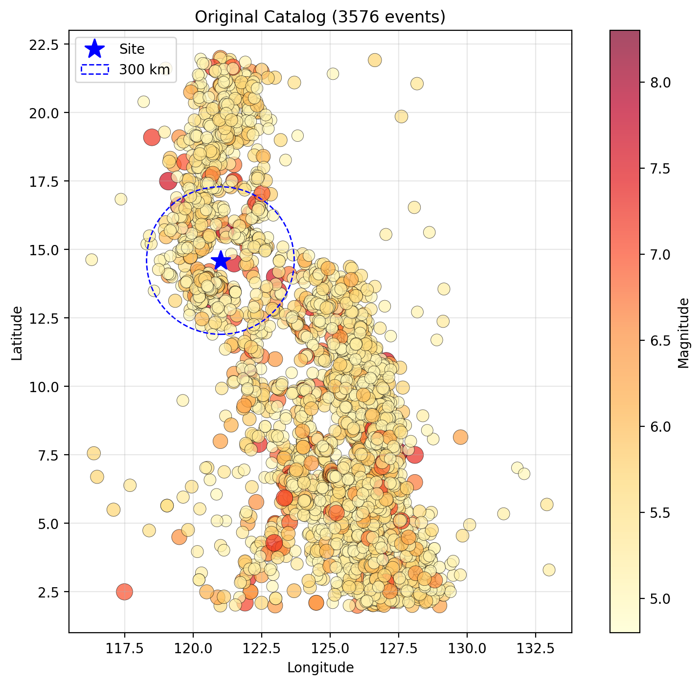
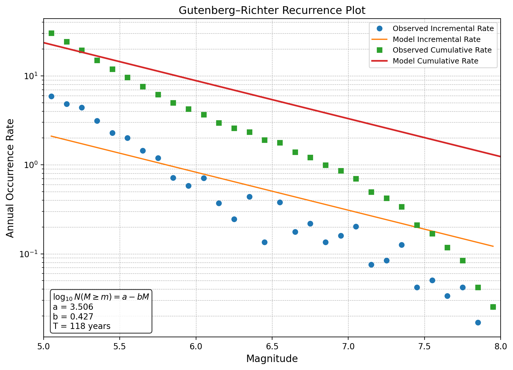
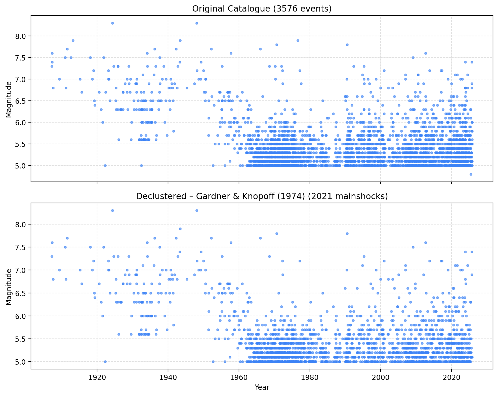

# PSHA Pre-Process

**Earthquake catalogue pre-processing web app for Probabilistic Seismic Hazard Analysis (PSHA),
built around the PHIVOLCS Earthquake Catalogue of the Philippines.**


Developed by **Albert Pamonag** and **Camille Pajarillaga** — APEC Team.
Analysis modules ported from the in-house `seismicprocesspy` toolkit.



## What it does

A Flask web app that takes the raw PHIVOLCS workbook (1907–2025, **3,577 events**, M ≥ ~5)
through the standard PSHA source-characterisation chain. The converted catalogue is bundled
and preloaded — every page runs out of the box, or accepts an uploaded CSV instead.

| Step | Page | Method | Key outputs |
|---|---|---|---|
| — | **Catalog** | Interactive Mapbox epicenter map; site lat/lon inputs (or a map click) list the top-5 events within 300 km | Map + legend, audit status, top-5 table, source notes |
| 1 | **Moment Magnitude (Mw)** | Homogenize to Mw (reported Mw > Ms→Mw > mb→Mw, Scordilis 2006 via Lamessa 2019, range-gated) | Homogenized CSV (`mag_mw` + basis), per-event conversion table (LaTeX), basis scatter |
| 2 | **Declustering** | Gardner-Knopoff windows (GK 1974, Grünthal, Uhrhammer 1986), mainshock = largest in cluster | Mainshock catalogues (CSV), maps, mag-time plots |
| 3 | **Completeness** | Stepp (1972), automated + manual tables | Completeness tables, sigma-lambda + density plots |
| 4 | **Gutenberg-Richter** | Aki MLE a/b values with Shi–Bolt error, completeness-corrected rates | Recurrence plot, rates CSV |
| 5 | **MFD** | Completeness-corrected rates by depth class | OpenQuake `ArbitraryMFD` + `TruncatedGRMFD` XML, rates CSV |
| 6 | **Max Magnitude** | Kijko–Sellevoll estimator (Kijko 2004) + observed Mmax, Mw-aligned cumulative moment | Mmax estimates, moment-release plot, per-event computation table |

<p>
  
  
</p>

UI: light/dark theme, numbered workflow sidebar, site-preset dropdown
(Project Site 14.62758° N, 121.08727° E or custom coordinates), fullscreen maps.

## Quick start

Windows:

```bash
py -m venv .venv
.venv\Scripts\pip install -r requirements.txt
.venv\Scripts\python web_app.py        # http://127.0.0.1:5000
```

macOS / Linux:

```bash
python3 -m venv .venv
source .venv/bin/activate
pip install -r requirements.txt
python web_app.py                      # http://127.0.0.1:5000
# macOS: AirPlay Receiver may occupy port 5000 — use PORT=5001 python web_app.py
```

Maps need a Mapbox token (any of):
- set the `MAPBOX_TOKEN` environment variable, or
- put the token in an untracked `mapbox_token.txt` next to `web_app.py`, or
- paste it into the token field in the UI.

## Data pipeline

```
data/source/*.xlsx ──convert_catalogue.py──▶ data/catalog.json + data/catalog.geojson
                                                      │
                                          audit_catalogue.py (must PASS)
                                                      ▼
                                    reports/audit_report.md + reports/audit.json
```

| Script | Purpose |
|---|---|
| `scripts/convert_catalogue.py` | Workbook → `catalog.json` (full fidelity + metadata) and `catalog.geojson` (Mapbox-ready; intensity text excluded) |
| `scripts/audit_catalogue.py` | Independent re-read of the workbook; exits non-zero on any capture failure |

### Conversion rules

- **Nothing is lost:** every non-empty workbook cell lands in exactly one bucket — preamble
  metadata, header metadata, or an event field. The audit proves the partition and reconciles
  all **47,046 data cells 1:1** (float tolerance 1e-9, text exact), across all ~1,010
  spreadsheet columns.
- **Magnitudes stay raw** per type (`ml`, `mb`, `ms`, `mw`); the preferred `mag` is the first
  available of **Mw > Ms > Mb > Ml**, recorded in `mag_type`. No empirical conversion is applied.
- **No silent fixes:** anomalies keep their raw values and are flagged in `qa_flags`.

### Event record schema (`data/catalog.json`)

| Field | Description |
|---|---|
| `id` | Sequential id (`PH-0001` …) in sheet/row order |
| `source_sheet`, `source_row` | Exact xlsx provenance of the event |
| `year month day hour minute second` | Origin-time components as published (GMT) |
| `datetime_utc` | ISO 8601 origin time; `null` when components are invalid |
| `latitude`, `longitude`, `depth_km` | Epicenter (°N, °E) and focal depth (km) |
| `ml mb ms mw` | Published magnitudes by type (`null` when not reported) |
| `mag`, `mag_type` | Preferred magnitude and which type supplied it |
| `intensity_reports` | Verbatim RF / PEIS intensity text |
| `qa_flags` | e.g. `invalid_datetime`, `ml_coerced_from_string` |

### Known source-data anomalies (audited, kept raw)

- Ml/Mb stored as **text** in the 1907–2018 sheet (1,250 + 1,855 cells) — coerced to float, flagged.
- One event (2019–2025 sheet, row 329; 2023-02-24, Mw 5.0) has **`Hour = 27`** → `datetime_utc`
  is `null`; excluded from time-based analyses but kept on the map and in the JSON.
- **24 exact duplicate** origin-time + location pairs (e.g. rows 323–327 repeated as 328–332) —
  worth reviewing before declustering.
- The workbook preamble's stated region/period do not match the actual data span
  (2–22° N, 116.3–133° E, 1907–2025); preserved verbatim in `metadata.notes`.

### Updating the catalogue

Drop a new PHIVOLCS workbook in `data/source/`, then:

```bash
.venv\Scripts\python scripts\convert_catalogue.py --xlsx "data/source/<new file>.xlsx"
.venv\Scripts\python scripts\audit_catalogue.py
```

The audit's expected-anomaly ledger is pinned to the known workbook's SHA-256: with a new
source file the ledger is reported (not asserted) — review it, then update `EXPECTED_LEDGERS`
in `scripts/audit_catalogue.py` to re-pin.

## Analysis pipeline (BBS Sec. 3.3.5 order)

Every analysis page runs the catalogue-preparation steps in order:

1. **Homogenize to Mw** — on by default: reported Mw > Ms→Mw > mb→Mw
   (Scordilis 2006 global relations, cited via Lamessa 2019), each applied only
   inside its validity range so the largest events (e.g. the Ms 8.3 maxima) are
   never extrapolated; Ml-only events pass through flagged. Paste
   `scale,slope,intercept` lines to override with your own cited coefficients.
2. **Remove duplicates** — on by default (60 s / 50 km / ΔM 0.5 tolerances).
3. **Decluster** — Gardner–Knopoff-style windows with the mainshock taken as the
   *largest* event of each cluster; foreshocks are removed too. GR/MFD/Mmax pages
   offer a "Decluster first" checkbox and warn when the input was not declustered.
4. **Completeness** — Stepp (1972) on the Completeness page; GR/MFD rates count
   events only inside each magnitude bin's period of completeness.
5. **GR / MFD fit** — Aki MLE b-value with Shi–Bolt standard error.
6. **Mmax** — Kijko–Sellevoll estimator (Kijko 2004, Eqs. 6–8).

The corrected, cited, doctested building blocks live in
`psha_preprocess/catalogue/pipeline.py` (reference of record:
`reference/psha_pipeline_reference.py`). One focal-depth convention is used on
all pages: shallow 0–35, mid-depth 35–70, deep 70–700 km (project convention).

## Tests

```bash
python3 -m pytest tests/ -q           # pipeline units + endpoint smoke tests
python scripts/audit_catalogue.py     # capture audit, exit 0 required
```

## Security defaults

- Uploads capped at 50 MB (`MAX_CONTENT_LENGTH`).
- The Werkzeug debugger is off unless `FLASK_DEBUG=1`; the app binds to
  127.0.0.1 only.
- Server-provided strings are HTML-escaped in the UI.
- The Mapbox token is interpolated into the page — use a public, URL-restricted
  token only.

## HTTP API

| Endpoint | Method | Notes |
|---|---|---|
| `/` | GET | Single-page app |
| `/api/catalog_info` | GET | Catalogue summary + audit status |
| `/data/catalog.json`, `/data/catalog.geojson` | GET | Converted catalogue |
| `/api/declustering` | POST | `use_default=1` or `file=@catalog.csv`; `site_lat`, `site_lon`, `use_gk/use_gr/use_uh`, `dedup`, `harmonize_coeffs` |
| `/api/completeness` | POST | `mode=auto\|manual\|both`, Stepp bins, depth classes |
| `/api/gutenberg_richter` | POST | `mc`, `dm`, `m_limit`, `m_max`, `compl_whole`, `dedup`, `decluster_first` |
| `/api/mfd` | POST | `dm`, `min_mag`, `max_mag`, per-depth completeness tables, `dedup`, `decluster_first` |
| `/api/max_magnitude` | POST | `mag_col`, `time_col`, `m_min`, `b_value` (empty = Aki MLE), `homogenize`, `dedup`, `decluster_first`; returns `events_detail` (per-event Mw basis + M0) for the clickable catalogue table |

All analysis endpoints accept either an uploaded `file` or `use_default=1` for the bundled
PHIVOLCS catalogue, and return JSON with base64-encoded plots.

## Project layout

```
web_app.py                    Flask app: 5 analysis APIs + catalog endpoints
psha_preprocess/catalogue/    pipeline (steps 1-6), completeness (Stepp 1972),
                              checker, converter, qaqc
scripts/                      convert_catalogue.py, audit_catalogue.py
data/                         source xlsx, catalog.json, catalog.geojson
reports/                      audit_report.md, audit.json
tests/                        pytest suite (pipeline + endpoint smoke tests)
reference/                    psha_pipeline_reference.py (cited reference implementations)
templates/, static/           sidebar UI, Mapbox maps, light/dark theme
docs/                         README images (generated by the app)
```

## Data source & disclaimer

Earthquake data: **Philippine Institute of Volcanology and Seismology (PHIVOLCS)**
Seismicity Map / earthquake catalogue; parameters are subject to recalculation by PHIVOLCS.
This tool is for APEC Team internal use; results depend on user-selected parameters
and should be reviewed by a qualified engineer before use in design.
